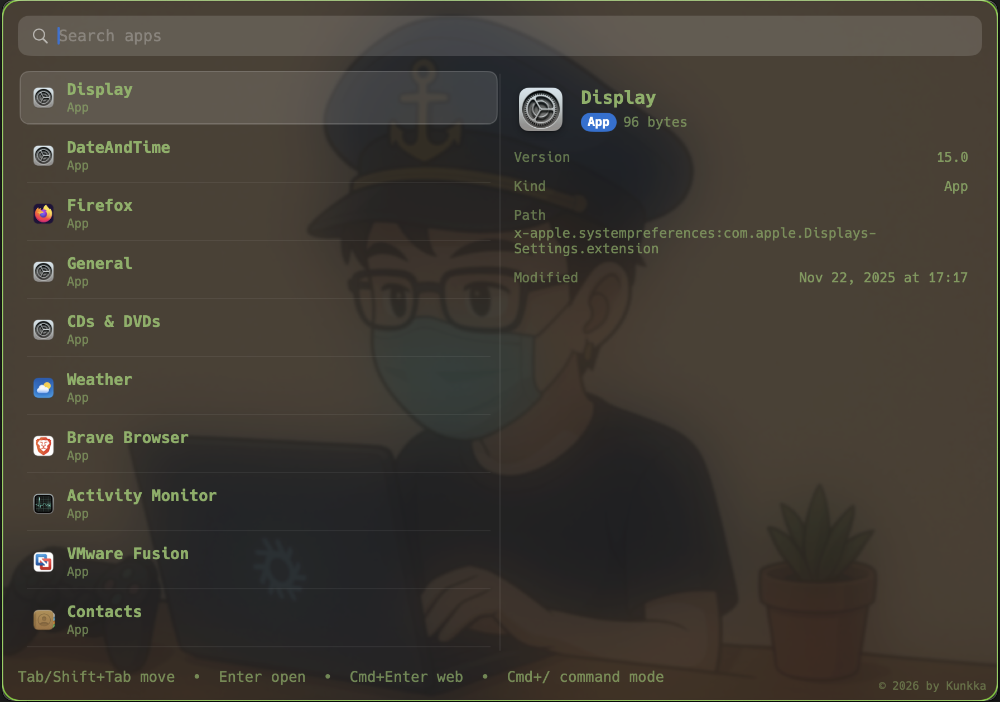
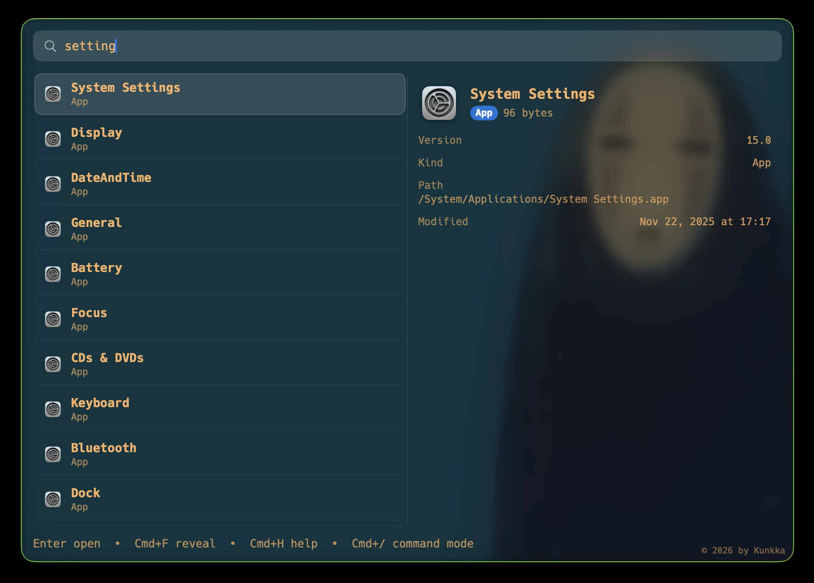
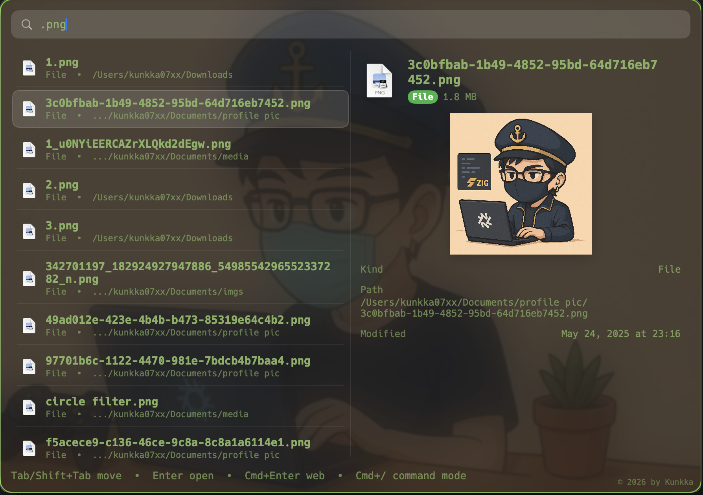
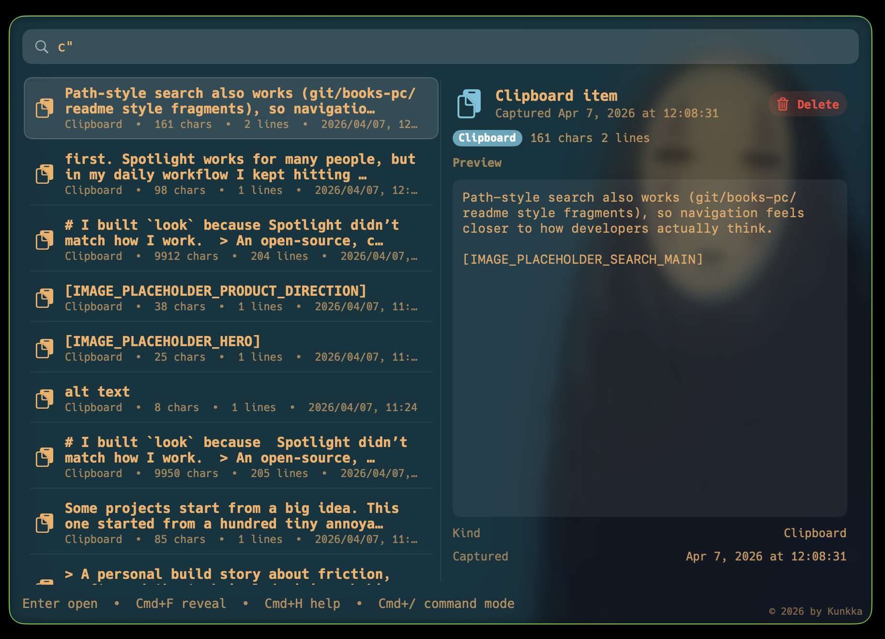
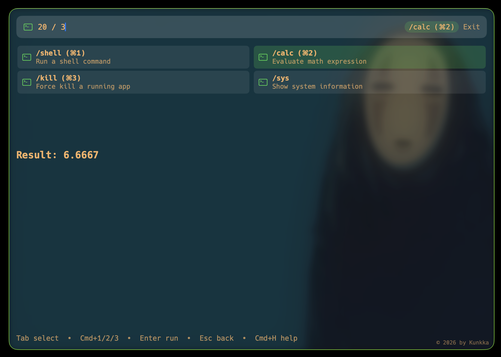
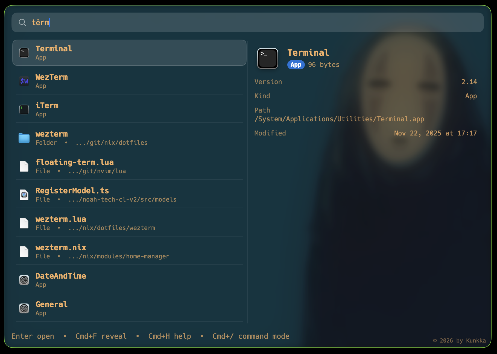

# look


`look` is a minimal, rofi-inspired macOS launcher focused on fast local actions,
built to feel instant: type, move, and launch without leaving the keyboard.

**Demo:** (Watch the demo video on **[youtube-video](https://www.youtube.com/watch?v=4Twb4We3PIs)** for better experience)


Highlights:

- very fast local app and file search
- clipboard history lookup with preview
- built-in quick commands (calculator, shell, force quit, system info)
- query aliases for apps + System Settings via `~/.look.config` (for example `alias_note`, `alias_code`)
- lightweight native app with local-first behavior

## Quick navigation

- [Installation](#installation)
- [Themes](#ui)
- [Current keyboard UX](#current-keyboard-ux)
- [Quick start](#quick-start)
- [Product scope](#product-scope)
- [Documentation](#documentation)

## Core workflow

- launch top result with `Enter`
- clipboard history query with `c"<word>`
- translate text with `t"word` (network, 3 results: VI/EN/JA)
- open dictionary lookup panel with `tw"word` (live as you type; `Enter` still works)
- web search handoff with `Cmd+Enter` (Google)
- reveal selected app/file/folder in Finder with `Cmd+F`
- command mode with `Cmd+/` (`calc`, `shell`, `kill`, `sys`)
- force-quit flow in command mode (`kill`, including process-by-port search like `:3000`)
- calc supports `^`, `!`, constants (`pi`, `e`), functions (`sqrt`, `abs`, `round`, `floor`, `ceil`), and `%` shorthand (`50%`, `200*15%`)

## Positioning

Compared with larger launcher ecosystems (for example Raycast, Alfred, and similar tools), `look` is intentionally focused:

- simple core workflow: app/file/folder search + a few built-in commands
- lightweight and local-first behavior
- fully open source
- free to use
- no plugin marketplace complexity in the default experience

If you want a minimal launcher that stays fast and predictable, `look` is built for that.

User-level behavior can be configured with `~/.look.config` (indexing + UI theme/font; see [User Guide](docs/user-guide.md) for supported keys).

Theme and alias notes:

- current built-in themes: Catppuccin, Tokyo Night, Rose Pine, Gruvbox, Dracula, Kanagawa, Custom
- built-in themes are available in `Settings > Appearance` and persisted in `~/.look.config`
- search aliases are configured with `alias_<keyword>=Term1|Term2|...` in `~/.look.config` and apply to app + System Settings search
- fresh config presets include `alias_note`, `alias_code`, `alias_term`, `alias_chat`, `alias_music`, and `alias_brow`
- `Settings > Advanced > Create Fresh Config` recreates the current config file from latest defaults (with confirmation popup)

Indexing config supports include roots plus exclude rules for both apps and files, including optional `file_scan_extra_roots` for user-specific directories.

## Repository layout

```text
.
├── apps/
│   └── macos/
│       └── LauncherApp/
├── core/
│   ├── engine/
│   ├── indexing/
│   ├── matching/
│   ├── ranking/
│   └── storage/
├── bridge/
│   └── ffi/
├── docs/
├── scripts/
└── assets/
```

## UI

Current built-in themes (Settings > Appearance):
- Catppuccin, Tokyo Night, Rose Pine, Gruvbox, Dracula, Kanagawa, Custom













## Project status

- Swift macOS app scaffold is located at `apps/macos/LauncherApp/look-app/` with project file `apps/macos/LauncherApp/look-app.xcodeproj`.
- Rust core workspace is initialized under `core/`.
- FFI bridge crate is initialized under `bridge/ffi/`.
- Benchmark example lives at `core/engine/examples/perf_bench.rs`.
- Architecture, roadmap, and initial design decisions are documented under `docs/`.
- UI includes: Spotlight-style launcher window (hidden from `Cmd+Tab`), theme/settings panel, command mode, and keyboard-first navigation.

- Backend currently includes: SQLite-backed candidate storage, dynamic app/settings/file indexing, and usage event logging.
- User guide: [docs/user-guide.md](docs/user-guide.md).
- Apple release signing/notarization guide: [docs/apple-developer-release-guide.md](docs/apple-developer-release-guide.md).
- Backend contributor guide (edit targets + verification): [docs/backend-guide.md](docs/backend-guide.md).
- Feature status: [docs/features.md](docs/features.md).
- Task breakdown: [docs/tasks.md](docs/tasks.md).
- Architecture guide (canonical): [docs/architecture.md](docs/architecture.md).

## Current keyboard UX

- `Tab` / `Shift+Tab`: next/previous result (app list) or next/previous command (command mode)
- `Up` / `Down`: navigate app list; in command mode, used for `kill` result navigation
- `Cmd+/`: enter command mode (defaults to `calc`)
- `Escape`: back to app list (when in command mode), otherwise hide launcher
- `Shift+Escape`: hide launcher
- `Cmd+1` / `Cmd+2` / `Cmd+3` / `Cmd+4`: switch command directly
- `Cmd+Q`: hide launcher (Spotlight-style safety)
- `Cmd+Option+Q`: quit app
- `Enter`: launch selected app, execute active command, run web translation (if `t"...`), refresh lookup translation (if `tw"...`), or confirm kill
- `Y` / `N`: confirm/cancel in kill command confirmation
- `Cmd+Enter`: web search current query using Google
- `Cmd+C`: copy selected file/folder to pasteboard
- `Cmd+F`: reveal selected app/file/folder in Finder
- `a"` / `f"` / `d"` / `r"`: apps/files/folders/regex scoped query prefix
- `c"`: clipboard history scoped query prefix
- `Cmd+Shift+,`: open/close settings panel
- `Cmd+Shift+;`: reload `.look.config` after manual file edits
- `Escape` (while settings open): close settings panel
- `Cmd+-`, `Cmd+=`, `Cmd+0`: temporary UI zoom out/in/reset

## Installation

Homebrew tap (recommended once release is published):

```bash
brew tap kunkka19xx/tap
brew install --cask look
```

Update:

```bash
brew upgrade --cask kunkka19xx/tap/look
```

Enable `Cmd+Space` for look (recommended):

- open `System Settings` -> `Keyboard` -> `Keyboard Shortcuts...` -> `Spotlight`
- disable `Show Spotlight search` or rebind it to another shortcut
- open look once, then use `Cmd+Space` as launcher toggle

If look is fully quit and Spotlight shortcut is disabled, relaunch from Terminal:

```bash
open "/Applications/Look.app"
```

Release builds are Developer ID signed and notarized, so normal first launch should open without Gatekeeper bypass.

Curl installer (after a GitHub release exists):

```bash
curl -fsSL https://raw.githubusercontent.com/kunkka19xx/look/main/scripts/install-look.sh | bash
which lookapp
```

CLI naming note:

- macOS already ships `/usr/bin/look`, so this project uses `lookapp` for terminal command examples

Manual installer options:

```bash
curl -fsSL https://raw.githubusercontent.com/kunkka19xx/look/main/scripts/install-look.sh | bash -s -- --version <version> --repo kunkka19xx/look
```

or direct URL:

```bash
curl -fsSL https://raw.githubusercontent.com/kunkka19xx/look/main/scripts/install-look.sh | bash -s -- --url "https://github.com/kunkka19xx/look/releases/download/v<version>/Look-<version>-macOS.zip"
```

## Quick start

Prerequisites:

- macOS 15.0+
- Xcode (for app shell)
- Rust stable toolchain (for core engine)

Rust workspace checks:

```bash
cd core
cargo check --workspace
```

FFI bridge checks:

```bash
cd bridge/ffi
cargo check
```

Run local dev app (from repository root):

```bash
make app-run
```

Install/open a side-by-side Launchpad test build (`Look Dev`) without replacing Homebrew `Look`:

```bash
make app-run-dev
```

`make app-run` behavior:

- builds local app bundle with Xcode (`Debug`)
- stops any running `Look` process first (including Homebrew-installed app instance)
- launches local app with `LOOK_CONFIG_PATH=$HOME/.look.dev.config`
- enables a red `TEST APP` badge in the window so local/dev run is visually distinct

`make app-run-dev` behavior:

- builds local app bundle with Xcode (`Debug`)
- installs `/Applications/Look Dev.app` with bundle id `noah-code.Look.Dev`
- keeps Homebrew-installed `/Applications/Look.app` untouched
- launches `Look Dev` with `LOOK_CONFIG_PATH=$HOME/.look.dev.config`

Override dev config path when needed:

```bash
make app-run DEV_CONFIG_PATH="$HOME/.look.qa.config"
make app-run-dev DEV_CONFIG_PATH="$HOME/.look.qa.config"
```

Prepare release artifacts/scripts (maintainers):

```bash
./scripts/build-release.sh 1.0.0
./scripts/generate-homebrew-cask.sh 1.0.0 <sha256> kunkka19xx/look
```

Signing/notarization in release CI:

- paid Apple Developer membership is required for Developer ID signing/notarization
- strict release runs require signing/notary secrets
- non-strict test runs can still build artifacts when secrets are missing

## Product scope

Platform direction:

- current primary target is macOS
- planned: Windows version (after macOS release quality is stable)
- Linux version is not a near-term priority because tools like `rofi` already cover much of this workflow well

Future direction:

- we will keep adding useful built-in features when they stay aligned with the simple/fast philosophy
- community ideas are welcome; strong ideas with clear user value can be prioritized into the roadmap
- near-future exploration includes a plugin/extension injection model for developer customization

In scope for first milestone:

- global hotkey opens launcher
- query app index and launch with Enter
- query file/folder name index and open/reveal
- query clipboard history (`c"`) and copy selected history item back to clipboard
- web search handoff with Google
- translate text with `t"...` (network, returns VI/EN/JA)
- dictionary lookup panel with `tw"...` (definitions/examples from installed dictionaries)
- command mode with `calc`, `shell`, `kill`, and `sys`
- predictable, local-first behavior

Out of scope for v1:

- plugins
- online-first behavior
- semantic/vector search
- content indexing

## Documentation

- User guide: [docs/user-guide.md](docs/user-guide.md)
- Architecture guide (canonical): [docs/architecture.md](docs/architecture.md)
- Feature status: [docs/features.md](docs/features.md)
- Backend guide (contributors): [docs/backend-guide.md](docs/backend-guide.md)
- Task tracking: [docs/tasks.md](docs/tasks.md)

## License

MIT

## Community

- Contribution flow:
  - branch from `dev` and open PRs into `dev`
  - use PRs to `main` only for maintainer-coordinated hotfix/release work
  - run local checks before PR: `cargo test --workspace --manifest-path core/Cargo.toml` and `cargo test --manifest-path bridge/ffi/Cargo.toml`
  - update docs when user-visible behavior changes

- Contributing guide: [CONTRIBUTING.md](CONTRIBUTING.md)
- Issue templates: [.github/ISSUE_TEMPLATE/](.github/ISSUE_TEMPLATE/)

## Author

- Kunkka
